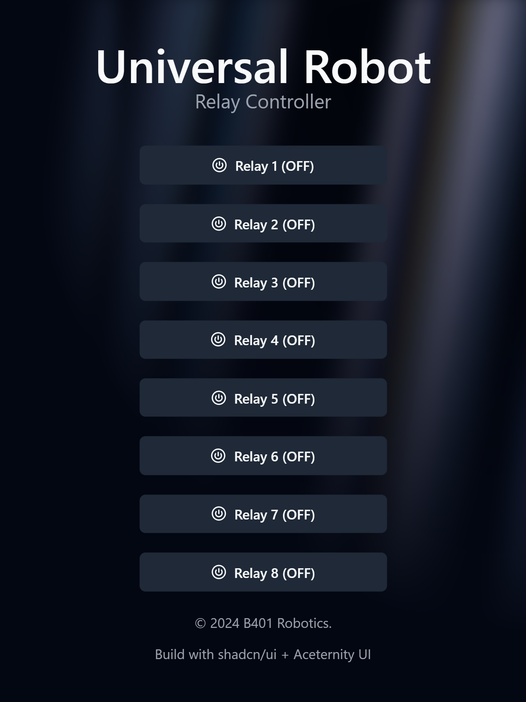
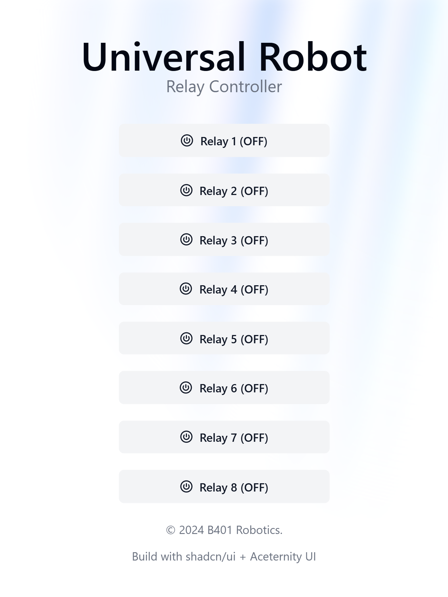

# ESP32 Universal Robot

This project is a firmware for ESP32 microcontroller connected with Universal Robot UR5 with 8 Channel Relay as an input.

## 🌟 Features

- Firmware built with Arduino and PlatformIO
- Web Page built with React and [Shadcn](https://ui.shadcn.com/)
- Web Page attached to ESP32
- API for controlling the relays

### Preview

|            Dark Mode Preview            |            Light Mode Preview             |
|:---------------------------------------:|:-----------------------------------------:|
|  |  |


## 🚀 Getting Started

### Prerequisites

- [PlatformIO](https://platformio.org/)
- [Node.js](https://nodejs.org/)

### Installation

1. Clone the repository
   ```sh
   git clone
    ```

2. Create a new file named `secrets.h` in the `src` folder and add the following code:
   ```cpp
    #pragma once

    #define WIFI_SSID "YOUR_WIFI_SSID"
    #define WIFI_PASSWORD "YOUR_WIFI_PASSWORD"
    ```

3. Build and upload the firmware to the ESP32
   ```sh
   pio run -t upload
   ```

4. Build and upload web interface to ESP32 filesystem image
   ```sh
   pio run -t uploadfs
   ```
   Notes: Dependecies for web interface are installed automatically by PlatformIO when you build filesytem image. For more information about script, check `script` folder.

## 📝 Documentation

### API

- `GET /ip` - Get the IP address of the ESP32
- `GET /status` - Get the status all of the relays
- `POST /relay/:id` - Set the state of the relay with the specified ID
    - Content-Type: application/x-www-form-urlencoded
    - Body: `state` (0 or 1)